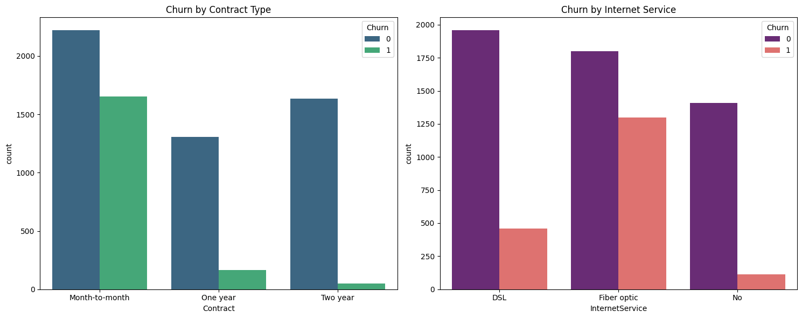
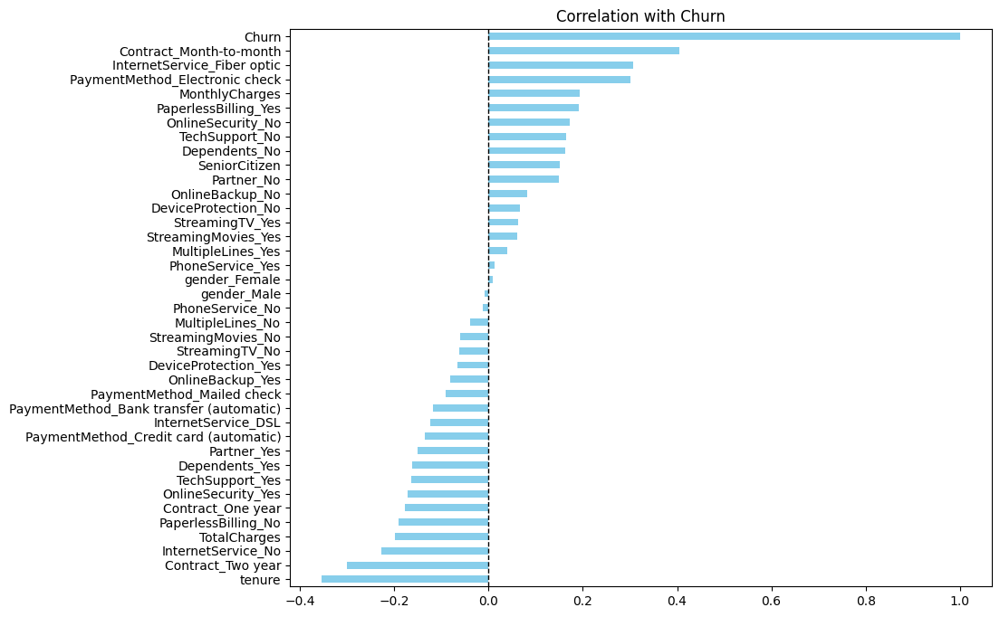
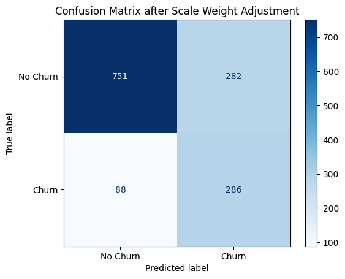
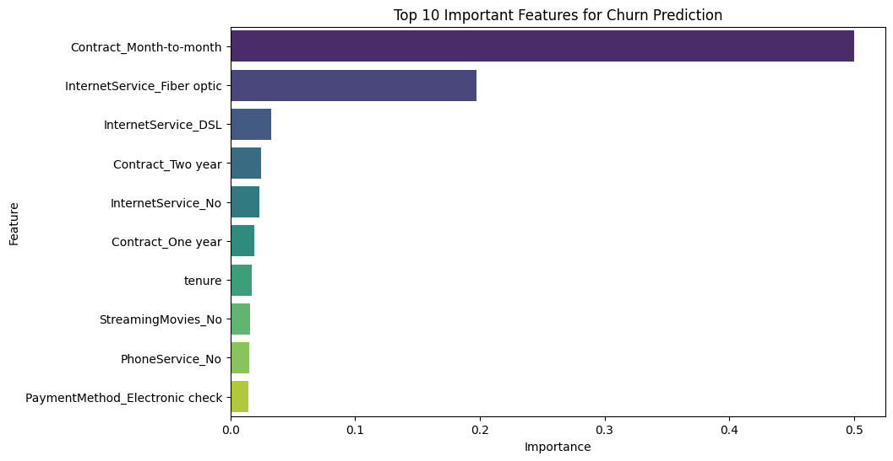

# 📊 Telco Customer Churn Prediction (End-to-End ML Project)

This project focuses on predicting customer churn for a telecommunications company using **XGBoost**. By identifying high-risk customers, the business can proactively implement retention strategies.

## 🚀 Key Achievements
* **Recall Improvement:** Optimized model sensitivity from **49% to 76%** using `scale_pos_weight` to address class imbalance.
* **Business Insight:** Identified **Month-to-month contracts** and **Fiber Optic service** as the primary churn drivers through feature importance analysis.

## 🛠️ Data Science Workflow
1.  **Data Cleaning:** Handled missing values and standardized numeric types.
2.  **EDA:** Visualized correlations and identified behavioral patterns.
3.  **Feature Engineering:** One-Hot Encoding with multicollinearity prevention.
4.  **Modeling:** Built an XGBoost classifier with customized sample weights.
5.  **Evaluation:** Analyzed results via Confusion Matrix and Classification Report.

## 📈 Key Visualizations

.

## 💡 Strategic Recommendations
* Target "Month-to-month" users for contract migration.
* Audit service quality for Fiber Optic users.
